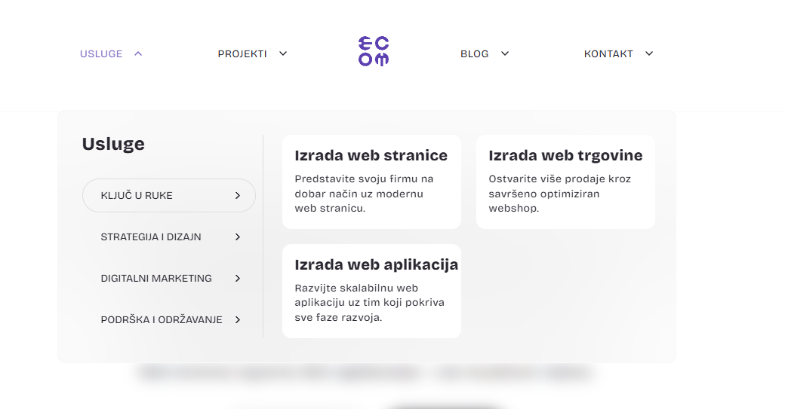

# ECOM Header Mega Menu



Self-contained Divi child-theme module that ships two shortcodes:

- `[ecom_mega_menu]` — desktop hover-driven mega menu
  (USLUGE / PROJEKTI / BLOG / KONTAKT, 4 service-category tabs inside USLUGE,
  featured-projects + featured-blog dropdowns, team + contact column inside
  KONTAKT, page-blur on hover, scroll-close).
- `[ecom_mobile_menu]` — sticky mobile header with hamburger + fullscreen
  overlay nav, scroll-hide on scroll-down / show on scroll-up.

The module was salvaged from a copy-paste dump (one giant `functions.php`,
inline styles, mixed-in unrelated code) and reorganized into the same
shape as `st-sticky-bottom-cta/`.

---

## Activation

Add this single line to your child theme's `functions.php`:

```php
require_once get_stylesheet_directory() . '/header-mega-menu/header-mega-menu.php';
```

It is intentionally **not** auto-required from the BHT theme yet — flip
the line on whenever you want to test or go live.

---

## Usage

Drop either shortcode wherever you need the markup — typically inside a
**Divi → Code module** placed in the global header / theme builder area:

```
[ecom_mega_menu]    -> renders the desktop layout
[ecom_mobile_menu]  -> renders the mobile layout
```

A default `@media (max-width: 980px)` breakpoint already hides the
desktop layout below 980px and the mobile layout above it, so you can
safely drop **both** shortcodes on the same page.

### Asset loading

CSS + JS are auto-enqueued **only** on requests where one of the two
shortcodes is present in `post_content`. If you wire the shortcodes into
a global Divi header (i.e. the shortcode is not part of the page's own
content), force-load the assets:

```php
add_filter( 'ecom_mega_menu_should_enqueue', '__return_true' );
```

---

## File structure

```
header-mega-menu/
├── README.md                ← you are here
├── LICENSE                  ← MIT
├── .gitignore
├── screenshot.png           ← desktop USLUGE submenu (used at the top of this README)
├── header-mega-menu.php     ← thin bootstrap, requires every includes/*.php
├── styles.css               ← all styles (desktop + mobile + dropdowns)
├── script.js                ← hover/blur, tab switch, hamburger, scroll-hide
└── includes/
    ├── config.php           ← ecom_mega_menu_get_config() + filter
    ├── assets.php           ← conditional wp_enqueue_scripts
    ├── render.php           ← [ecom_mega_menu] + [ecom_mobile_menu]
    └── dropdowns.php        ← [projekti_dropdown] + [blog_dropdown]
```

---

## Configuration

Single filter — `ecom_mega_menu_config` — receives the defaults array.
Override any subset of keys:

```php
add_filter( 'ecom_mega_menu_config', function ( $cfg ) {

    // Replace logo + link target
    $cfg['logo_svg']  = '<svg …>…</svg>';
    $cfg['logo_url']  = home_url( '/' );

    // Replace KONTAKT column content
    $cfg['contact'] = array(
        'phone'   => '+1 555 0000',
        'email'   => 'hello@bluehearttravel.com',
        'address' => '1 Example St, Zagreb, Croatia',
    );

    // Replace team tiles
    $cfg['team'] = array(
        array( 'image' => '/wp-content/uploads/2026/01/jane.webp', 'name' => 'Jane Doe', 'role' => 'Founder' ),
    );

    // Point featured-projects dropdown at BHT's `tour` CPT + `featured` tag
    $cfg['featured_projects']['post_type'] = 'tour';
    $cfg['featured_projects']['taxonomy']  = 'tour_tag';
    $cfg['featured_projects']['term']      = 'featured';

    // Reorder mobile overlay
    $cfg['mobile_links'] = array(
        array( 'label' => 'Tours',   'url' => '/tours',   'is_cta' => false ),
        array( 'label' => 'About',   'url' => '/about',   'is_cta' => false ),
        array( 'label' => 'Contact', 'url' => '/contact', 'is_cta' => true  ),
    );

    return $cfg;
} );
```

| Key                 | Purpose |
| ------------------- | --- |
| `logo_svg`          | Inline SVG markup printed **raw** in the desktop logo slot. Whoever overrides this is responsible for trusted markup. |
| `logo_url`          | Link target for both desktop and mobile logo. |
| `logo_aria_label`   | Aria-label on the logo `<a>`. |
| `contact`           | Assoc array `{ phone, email, address }` printed under the KONTAKT submenu. Each line is hidden if its value is empty. |
| `team`              | Array of `{ image, name, role }` tiles in the KONTAKT submenu. |
| `featured_projects` | `WP_Query` config for `[projekti_dropdown]`: `post_type`, `taxonomy`, `term`, `count`, `meta_field` (post-meta key shown under title; e.g. `'Client'` — set to `''` to hide), `empty_message`. |
| `featured_blog`     | Same shape as above (no `meta_field`) for `[blog_dropdown]`. |
| `mobile_links`      | Array of `{ label, url, is_cta }` for the fullscreen overlay nav. `is_cta: true` renders the dark pill. |

### Suppress / scope assets

```php
// Never enqueue
add_filter( 'ecom_mega_menu_should_enqueue', '__return_false' );

// Force-enqueue everywhere (e.g. when shortcodes live in a global header)
add_filter( 'ecom_mega_menu_should_enqueue', '__return_true' );
```

---

## Removed during cleanup

The original `functions.php` had three chunks of code that have nothing
to do with the mega menu — they were **deleted**, not relocated. If you
were depending on any of them, copy them back into the theme's main
`functions.php` (or, better, into a small dedicated module under
`inc/`):

1. **Three Rank Math breadcrumb filters** (`rank_math/frontend/breadcrumb/items`)
   — one removing categories from single posts, one inserting `Blog >` /
   the post title, one inserting `Projekti >` for the `project` CPT.
2. **`/projekti/` rewrite scaffolding** — `add_rewrite_rule`,
   `post_type_link` filter, `query_vars` filter, and a one-shot
   `flush_rewrite_rules` guarded by an option (`project_projekti_rewrite_flushed_v2`).
3. **Viewport meta override** — `db_remove_et_viewport_meta` /
   `db_enable_pinch_zoom` (re-enabling pinch zoom by removing Divi's
   default viewport tag).
4. **Orphan jQuery hider** in `script.js` — a `$('.kategorija-2')` empty
   check used by an unrelated project loop on the source site.

---

## Brief test plan

1. Add the activation `require_once` line to `bht-child-theme/functions.php`.
2. Create a draft Page → paste both shortcodes → preview:
   ```
   [ecom_mega_menu]
   [ecom_mobile_menu]
   ```
3. **Desktop ≥ 981 px:**
   - Hover USLUGE / PROJEKTI / BLOG / KONTAKT → submenu appears, arrow
     rotates 180°, label turns purple, `#et-main-area` blurs.
   - In USLUGE, click each of the 4 category buttons → right-side card
     list swaps.
   - Scroll the page → any open submenu closes.
4. **Mobile ≤ 980 px:**
   - Sticky header sits at the top with logo + hamburger.
   - Tap hamburger → fullscreen overlay slides in, body scroll locks,
     `aria-expanded` flips to `true`.
   - Scroll down → header hides; scroll up → header reappears.
5. **Featured dropdowns:** with the default config the BHT site has no
   `project` CPT or `istaknuto` term, so the PROJEKTI dropdown shows
   "Nema istaknutih projekata." Apply the documented filter to retarget
   to a real BHT post type/term and confirm cards render.
6. **Filter smoke test:** override `contact` via `ecom_mega_menu_config`
   → KONTAKT submenu shows the new phone/email/address.
7. Remove the activation line → shortcodes are inert, no orphan CSS/JS
   loads.

---

## License

[MIT](LICENSE) © 2026 Josip Meštrović.

The original markup was reverse-engineered from a copy-paste dump of an
E-COM agency mega menu and rewritten as a clean, reusable module. The
bundled default `logo_svg`, contact info and team tiles still reflect
E-COM branding — override them via `ecom_mega_menu_config` before
shipping the module on a different brand.
